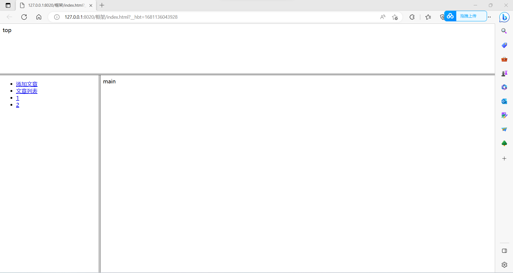
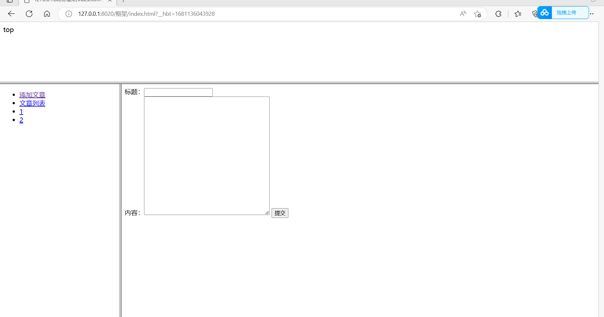

- ##### [简单的HTML页面架构](#一、简单的HTML页面架构)

- ##### [HBuilder编译器](#二、HBuilder编译器)

- ##### [HTML常见标签](#三、HTML常见标签)

- ##### [form表单](#四、form表单)

- ##### [table表格](#五、table表格)

- ##### [列表标签](#六、列表标签)

- ##### [框架](#七、框架)

<!--more-->

### 一、简单的HTML页面架构

```html
<!DOCTYPE html>
<html>
	<head>
		<title></title>
	</head>
	<body>
	</body>
</html>
```

### 二、HBuilder编译器

- 保存的快捷方式 **ctrl+s**
- 自动生成简单页面架构
- 链接：https://pan.baidu.com/s/1peqP33i_RBJTNfGi3ECzKw?pwd=hdf3 
  提取码：hdf3

### 三、HTML常见标签

- **!--**xxxxxx-- 注释

- **head内的标签**

  - **meta标签** 可以提供有关页面的元信息，比如针对搜索引擎和更新频度的描述和关键词
    - 设置网站关键字：meta name= "keywords"  content= "关键词" charset=“编码”
    - charset 编码 **gbk gbk2312 utf-8**

  ```html
  <meta charset="utf-8">
  <meta name="keywords" content = "网络安全，web基础"></meta>
  ```

  - **link标签** 定义文档与外部资源的关系

  - **script标签** 引入js文件

- **body内的标签**

  - **p标签** 段落
  - **hx 标题标签** 从h1 到h6 由大变小
  - **br标签** 换行标签
  - **hr标签** 换行线标签

```html
<p>这是一段文本</p><br>
<h1>h1</h1><h2>h2</h2><h3>h3</h3><h4>h4</h4><h5>h5</h5><h6>h6</h6>
<hr></hr>
```

<p>这是一段文本</p><br>
<h4>h4</h4><h5>h5</h5><h6>h6</h6>
<hr></hr>

- **文本属性标签**
  - **strong标签  b标签** 加粗
  - **i标签** 斜体
  - **u标签** 下划线
  - **sup sub标签** 上标下标
  - **del标签** 删除线
  - **font标签** 规定字体的属性
    - **size** 字体大小 font size=""
    - **color** 字体颜色
  - **pre标签** 按代码原样输出

```html
<p><strong>这是一段文本</strong><b>这是</b><i>一段文本</i><u>这是一段文本</u>这是<sub>一段文本</sub>这是<sup>一段文本</sup><del>这是一段文本</del><font size="1px" color="red">这是一段文本</font></p><br>
```

<p><strong>这是一段文本</strong><b>这是</b><i>一段文本</i><u>这是一段文本</u>这是<sub>一段文本</sub>这是<sup>一段文本</sup><del>这是一段文本</del><font size="1px" color="red">这是一段文本</font></p><br>


- **特殊标签 a标签**
  - **href** 跳转地址href="https://   "
  - **href** 锚文本href="#{name}"
  - **target** 跳转方式:
    - _self 默认，在相同的框架中打开被链接文档
    - _blank 在新窗口中打开被链接文档
    - _parent 在父框架集中打开被链接文档
    - _top 在整个窗口中打开被链接文档


```html
<a href="https://www.baidu.com">百度</a>
<a href="https://www.baidu.com" target="_blank">百度</a>
<a href="#简单的HTML页面架构">锚文本</a>
```

<a href="https://www.baidu.com">百度</a>
<a href="https://www.baidu.com" target="_blank">百度</a>
<a href="#简单的HTML页面架构">锚文本</a>

- **特殊标签 img标签**
  - **scr** 图片地址 本地/外网
  - **width height** 宽、高
  - **alt** 文件显示失败时显示的文字

### 四、form表单

- **form表单** 规定当前提交表单时向何处发送表单数据
- **method** 提交方法 有 **get post**
- **enctype** 规定在发送表单数据之前如何对其进行编码
  - application/x-www-form-urlencoded  默认
  - multipart/form-data 
  - text/plain 文本，一般不用
- **input标签** 输入框
  - name 表示文本输入框名称
  - size 输入框的长度大小
  - maxlength 允许输入的最大字符数
  - value 输入框中的默认值
  - readonly 表示该框中只能显示，不能添加修改
  - **input类型**
    - type = text 文本
    - type = password 密码输入框
    - type = file 文件上传
    - type = hidden 隐藏域
      - 在页面上看不到
      - 在查询数据时看得到
    - type = button 按钮
    - type = checkbox 复选框
    - type = radio 单选框
      - name属性一样的单选
    - type = submit 提交按钮
      - 将数据提交到服务器 
    - type = reset 重置按钮

```html
<!--文件上传-->
<form method="post" enctype="multipart/form-data" name="fileupdata">
    <input type="file">
    <input type="submit">
</form>
<!--登入-->
<form method="get" name="login">
    <lable>用户名：</lable><input type="text" size="15" maxlength="10" value="admin"><br>
    <lable>密&nbsp;&nbsp;码：</lable><input type="password" size="15"><br>
    <input type="submit" value="登入"><input type="reset" value="重置">
</form>
<!--上传表单-->
<form name="loadupskills">
    <lable>性别&nbsp;&nbsp;：</lable><lable>男</lable><input type="radio" name="sex"><lable>女</lable><input type="radio" name="sex"><br>
    <lable>拥有技能：</lable><lable>web渗透</lable><input type="checkbox"><lable>内网穿透</lable><input type="checkbox">
</form>
```

<!--文件上传-->

<form method="post" enctype="multipart/form-data" name="fileupdata">
    <input type="file">
    <input type="submit">
</form>

<!--登入-->

<form method="get" name="login">
    <lable>用户名：</lable><input type="text" size="15" maxlength="10" value="admin"><br>
    <lable>密&nbsp;&nbsp;码：</lable><input type="password" size="15"><br>
    <input type="submit" value="登入"><input type="reset" value="重置">
</form>

<!--上传表单-->

<form name="loadupskills">
    <lable>性别：&nbsp;&nbsp;</lable><lable>男</lable><input type="radio" name="sex"><lable>女</lable><input type="radio" name="sex"><br>
    <lable>拥有技能：</lable><lable>web渗透</lable><input type="checkbox"><lable>内网穿透</lable><input type="checkbox">
</form>


### 五、table表格

- **caption** 表格带标题
- **border** 边框
- **width height** 宽、高
- **colspan rowspan** 行、列合并
- **tr th td** 行单元格 表头单元格 标准单元格 一般th内部文本居中粗体，td内左对齐普通文本
- **cellpadding** 单元边与内容的空白
- **cellspacing** 单元格的空白

```html
<table border="10">
    <caption>这是一个表格标题</caption>
    <tr><th>#</th><th>姓名</th><th>年龄</th></tr><br>
    <tr><td>1</td><td>张三</td><td rowspan="2">20</td></tr><br>
    <tr><td>2</td><td>李四</td></tr><br>
    <tr><td>3</td><td>王五</td><td>21</td></tr><br>
    <tr><td>总人数</td><td colspan="2">3</td></tr>
</table>
```

<table border="10">
    <caption>这是一个表格标题</caption>
    <tr><th>#</th><th>姓名</th><th>年龄</th></tr><br>
    <tr><td>1</td><td>张三</td><td rowspan="2">20</td></tr><br>
    <tr><td>2</td><td>李四</td></tr><br>
    <tr><td>3</td><td>王五</td><td>21</td></tr><br>
    <tr><td>总人数</td><td colspan="2">3</td></tr>
</table>


### 六、列表标签

- **li 标签** 每一行表示标签
- **ul 标签** 无序标签
  - square 方框
  - circle 空心圆圈
  - disc 实心圆圈
- **ol 标签** 有序标签
  -  数字列表 默认 数字
  - 小写字母列表 a
  - 大写字母列表 A
  - 罗马字母列表  I
  - 小写罗马字母列表 i	

```html
<ol type="a">
    <li>文本</li><li>文本</li><li>文本</li>
</ol>
<ul>
    <li>文本</li><li>文本</li><li>文本</li>
</ul>
```

<ol type="a">
    <li>文本</li><li>文本</li><li>文本</li>
</ol>
<ul>
    <li>文本</li><li>文本</li><li>文本</li>
</ul>

### 七、框架

- **frameset标签** 可定义一个框架集。它被用来组织多个窗口（框架）。每个框架存有独立的文档。在其最简单的应用中，frameset 元素仅仅会规定在框架集中存在多少列或多少行。必须使用 cols 或 rows 属性，不能嵌套在body标签里
- **frame标签** 在frameset中使用的框架
- **scrolling**  滚动条
  - auto	在需要的情况下出现滚动条（默认值）
  - yes	始终显示滚动条（即使不需要）
  - no	从不显示滚动条（即使需要）

**index.html**

```html
<frameset rows="20%,*">
	<frame src="top.html" />
	<frameset cols="20%,*">
		<frame src="left.html" />
		<frame src="main.html" name="add"/>
	</frameset>
</frameset>
```

**left.html**

```html
<body>
	<ul>
		<li><a href="add.html" target="add">添加文章</a></li>
		<li><a href="artlist.html" target="add">文章列表</a></li>
		<li><a href="#">系统信息</a></li>
		<li><a href="#">备份</a></li>
	</ul>
</body>
```

**add.html**

```html
<body>
	<form method="post">
		标题：<input type="text" /><br>
		内容：<textarea cols="40" rows="20"></textarea>
		<input type="submit" />
	</form>
</body>
```

**main.html**

```html
<body>
        main
</body>
```

**top.html**

```html
<body>
    top
</body>
```

**artlist.html**

```html
<body>
    <ol>
       <li>1</li>
       <li>2</li>
    </ol>
</body>
```




